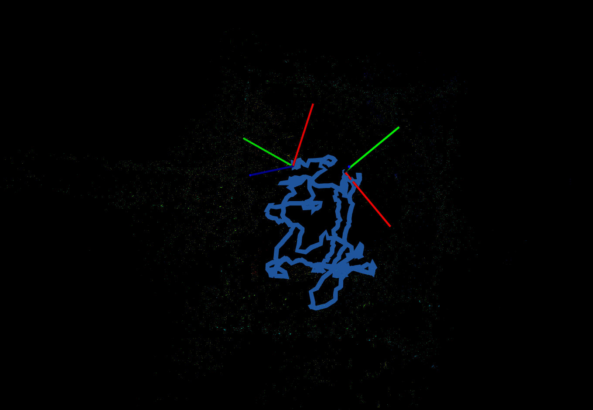

# signal-image-keypoints-odom

## Installation

### Clone our repo
```
git clone git@github.com:RealYXJ/ws-lidar-as-camera-odom.git
cd ws-lidar-as-camera-odom
git checkout optimize_code_zhz
git submodule update --init --recursive

```

### Install Dependency
```
<!-- libtorch -->
cd ws-lidar-as-camera-odom/src/ && mkdir libs && cd libs
wget https://download.pytorch.org/libtorch/cpu/libtorch-cxx11-abi-shared-with-deps-1.11.0%2Bcpu.zip
unzip libtorch-cxx11-abi-shared-with-deps-1.11.0+cpu.zip
rm libtorch-cxx11-abi-shared-with-deps-1.11.0+cpu.zip
```
Note: The lastest version will cause problems like unference to ros::init even though I have linked with `${catkin_LIBRARIES}`. Same problem has met by other people in https://github.com/pytorch/pytorch/issues/60178. I followed the solution provided by mmurooka commented on Nov 2, 2022 (https://github.com/mmurooka/SMPLpp/issues/1). Issue solved.

## Remember to check several files to make sure that we have the right absolute path

## cmake build oand run our project
```
cd ws-lidar-as-camera-odom/
catkin build
```


## Optimize step 
```
cd ws-lidar-as-camera-odom/
source devel/setup.bash
```


Run the keypoint extractor ros node
```
roslaunch signal-image-keypoints-odom signal-feature-odom.launch
```
Run the pointcloud matching approach for the odometry, or you can choose topic:=//os_cloud_node/points

```
roslaunch kiss_icp odometry.launch topic:=/keypoint_point_cloud
```

Run CPU_monitor

```
roslaunch cpu_monitor cpu_monitor.launch poll_period:=1
```

Run python scripts to show CPU and memory usage of our nodes, cpu_mem2.py will print the current mean value of CPU and memory usage of our nodes. If you just use the original raw pointcloud directly to kiss-icp, please set: use_keypoint_pointcloud=False, inside the codes.

```
python cpu_mem2.py 
```

Play the rosbag

```
rosbag play [rosbag that you have]
```

### What I modified:
1. delele several useless variable and function inside the class
1. rearrange the class member,change the name of many function and variable, to make them more clear
2. inside pointCloudCallback function, can just use one line: pcl::fromROSMsg(*msg, *entirePointCloudPtr_);
3. unify the signalImageCallback and rangeImageCallback function, just use cv_bridge::toCvShare, no need to use cv_bridge::toCvCopy, because we always copy the variable inside the superpoint_timerCallback function
4. turn extract_neighbourhood into a class member function， so increase encapsulation
5. threshold inside the extract_neighbourhood, is weird, 300 will not work as we want, because the image range in between [0,1]
6. we can just use signal_mp.convertTo(signal_mp, CV_32F, 1.0 / 65535.0), it's more loseless compared to the previous one.
7. if (u>SH_ || v > SW_)....... these if situations will not happen, so we don't need them.
8. add cpu_monitor to submodule


### KISS-ICP with raw point cloud


### KISS-ICP with conventional keypoint extractors



### KISS-ICP with the superpoint feature extractor


### KISS-ICP with raw point cloud


### KISS-ICP with conventional keypoint extractors


### KISS-ICP with the superpoint feature extractor

