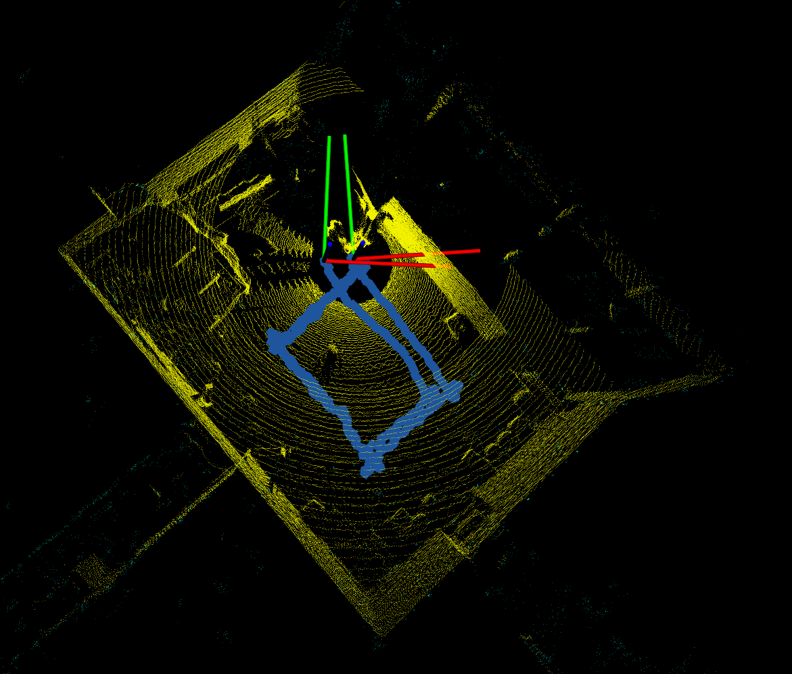

# signal-image-keypoints-odom

## Installation
```
git clone --recurse-submodules git@github.com:RealYXJ/ws-lidar-as-camera-odom.git
cd ws-lidar-as-odom
catkin build 
```


## Run 
```
source ws-lidar-as-odom/devel/setup.bash
```

Run the ROS master in one terminal 
```
roscore
```

Run the keypoint extractor ros node by either
```
roslaunch signal-image-keypoints-odom signal-feature-odom.launch
```
or
```
cd ws-lidar-as-camera-odom/src/signal-image-keypoints-odom/superpoint_extractors
# in the proper python envrionment
python superpoint_evaluation.py
```

Run the pointcloud matching approach for the odometry 
```
roslaunch kiss_icp odometry.launch topic:=/keypoint_point_cloud
```

(Optional) if you would like to run kiss-icp directly with raw point cloud.
```
roslaunch kiss_icp odometry.launch topic:=/os_cloud_node/points

```

Play the rosbag
```
rosbag play indoor01_square.bag
```

## Results

### KISS-ICP with raw point cloud



### KISS-ICP with conventional keypoint extractors


### KISS-ICP with the superpoint feature extractor


